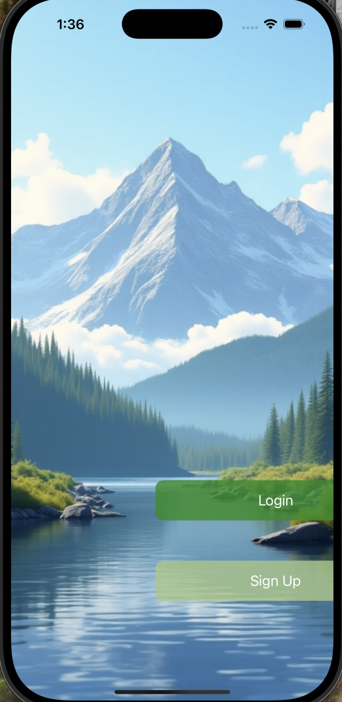

# LoginSignUpUIKit
iOS Login &amp; Signup App using UIKit and Core Data A simple user authentication app with registration, login, and profile management built using UIKit and Core Data for local data storage.

## 📱 Preview

  
  
  
  

